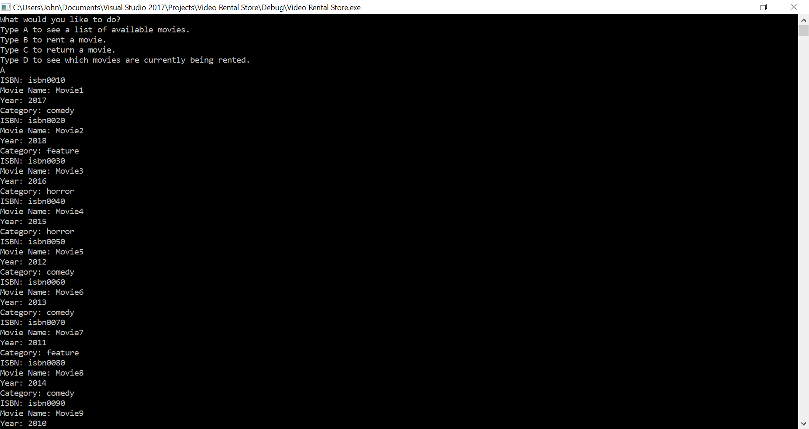
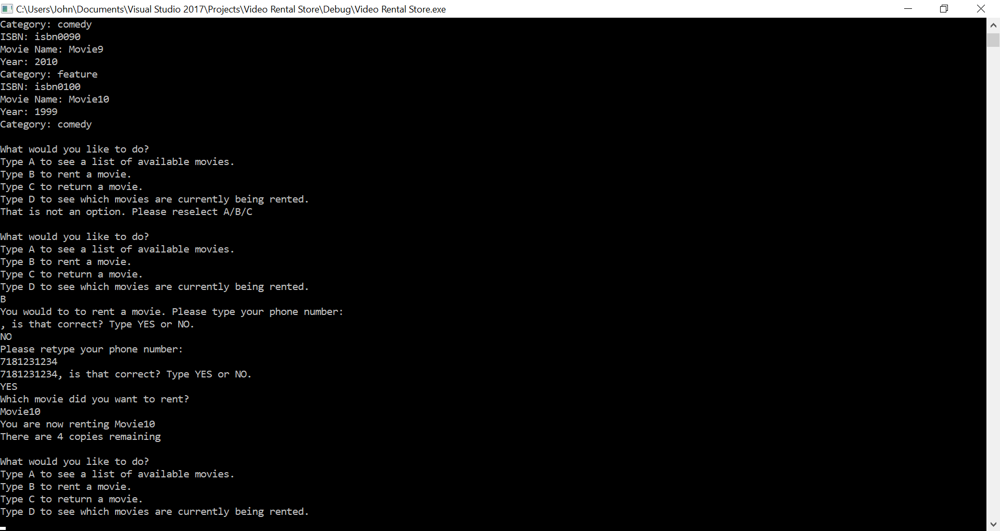
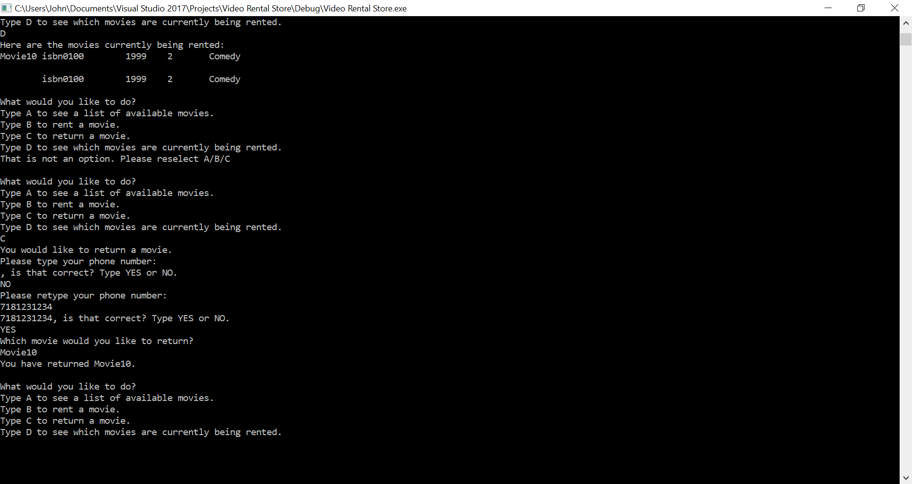

# Video Rental Store - CSC 330 Project 1
This is my first project from CSC 330 - Oject Oriented Software Design This program will offer the user a menu where they may:
*See a list of movies available for rent
*Rent a movie ->Return a movie 
*See a list of movies being currently rented The program will export the currently rented movies to a text file called rentals.txt The list of movies in the catalog are stored in store.txt

## Getting Started

The following instructions will explain how to run this program. Included in the repo are:
* Screenshot of the program input and output
* An executable file (Doubly Linked Lists cpp.exe) that will run the program without requiring any compilation
* The necessary source and header files to rebuild the application should you choose to do so

### Prerequisites

What things you need to install the software and how to install them
* Update your operating system and installation of GCC or Microsoft Visual Studio

### Installing
* Go to: (https://www.visualstudio.com/)
* Download the appropriate version of Visual Studio for your Operating System
* NOTE: I recommend using the Community Edition

## Running the tests
You may run the executable if running a Windows platform. This application has been tested on Windows 10 version 1709.
However, this should work on Visual Studio for Mac and GCC with no issues.
If you recompile:
* Open Visual Studio
* Go to New -> Project
* Go to the Installed drop-down and select Visual C++
* Choose Empty Project and change the title as needed
* In Solution Explorer on the right side, Right-click on Source File and Select Add>

I would recommend importing the files from the repo.
You would need:
* main.cpp
* Customer.h
* Movie.h
* Person.h
* Rental.h
* Store.h
* store.txt

Finally, go to the toolbar menu up top and select Debug
* Select Start Without Debugging

You may also clone the repo and open up the file: Doubly Linked Lists cpp.sln

## Running the tests with GCC
If you are running a Linux OS, you may install GCC (GNU C Compiler).
In Ubuntu, it should be preinstalled. If it is not, open up Terminal and run the command:
* sudo apt-get install gcc

In Arch Linux:
*sudo pacman -S gcc

In the terminal, cd to the location of the cloned repo
* cd into the inner folder: Video Rental Store

For example:
* cd ~/Downloads/Video\ Rental\ Store/Video\ Rental\ Store/

Run:
* g++ main.cpp -o myAppName -std=c++11 
* chmod a+x myAppName
* sh ./myAppName

## Screenshot of application

## Built With
* [Miscrosoft Visual Studio](https://www.visualstudio.com/) - Microsoft's IDE
* [GCC](https://gcc.gnu.org/) - The GNU C Compiler

## Authors
* John Cosentino - [GitHub](https://github.com/jcosentino)

